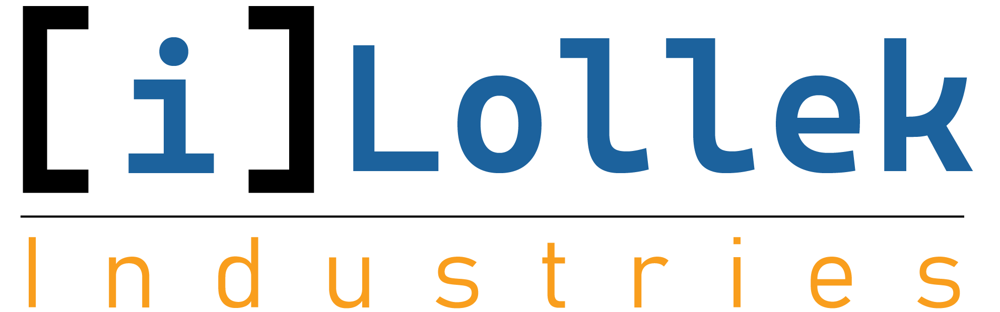

# iLollek Industries  
*We bring your technological visions to life!*

---

## 🚀 Unsere Leistungen  
Wir bieten Ihnen maßgeschneiderte IT-Lösungen – von modernen Websites bis hin zu individuellen Softwareentwicklungen für Ihr Unternehmen. iLollek Industries ist Ihr zuverlässiger Partner für die Digitalisierung Ihrer Geschäftsprozesse.

### Was wir für Sie tun können:

- **Komplettpakete für Websites**  
  Design, Fotografie, Programmierung, Datenbankanbindung, Responsivität, SEO, Inbetriebnahme und Pflege – alles aus einer Hand.

- **Individuelle Softwarelösungen**  
  Entwicklung von maßgeschneiderter Inhouse-Software, z. B. zur Kundenverwaltung oder Prozessautomatisierung.

- **Discord-Bots für Ihre Community**  
  Intelligente und leistungsfähige Bots zur Moderation, Organisation und Unterhaltung.

- **Prozessautomatisierung**  
  Automatisierte Abläufe zur Effizienzsteigerung in Verwaltung, Kundenkommunikation und mehr.

- **Datenbankentwicklung & -verwaltung**  
  Planung, Aufbau und Pflege skalierbarer Datenbanksysteme – sicher, performant und anpassbar.

- **Einrichtung von IT-Systemen**  
  E-Mail-Infrastruktur, VoIP-Telefonanlagen, Cloud-Lösungen und mehr – wir bringen Struktur in Ihre digitale Kommunikation.

---

## 💡 Ihr Vorsprung durch Digitalisierung  
Wir machen Ihr Unternehmen fit für die digitale Zukunft – effizient, professionell und benutzerfreundlich.  
**iLollek Industries – Wir setzen Ihre digitalen Vorstellungen professionell um.**

---

## 🏆 Unsere Referenzen  
Wir sind stolz darauf, bereits viele zufriedene Kunden aus verschiedenen Branchen zu betreuen. Hier einige unserer Projekte:

- [MAGIN Elektrotechnik GmbH](https://maginelektrotechnik.de)  
- [PMC Eesti](https://ilollek.net/pmc-eesti)  
- [Division Dubbeglas](https://division-dubbeglas.de)

---

## ⚙️ So arbeiten wir – Ihr Projektablauf bei iLollek Industries

1. **Ihre Idee**  
   Alles beginnt mit Ihrer Vision oder Ihrem konkreten Bedarf. Sie teilen uns Ihre Vorstellungen mit – egal ob Website, Software oder Bot.

2. **Gemeinsame Planung & Angebotserstellung**  
   In einem ausführlichen Gespräch planen wir das Projekt, klären Ihre Wünsche und Anforderungen. Anschließend erhalten Sie ein transparentes und maßgeschneidertes Angebot.

3. **Ihre Entscheidung**  
   Sie nehmen das Angebot an – oder lehnen ab. Wir arbeiten nur mit Kunden zusammen, die von unserer Lösung überzeugt sind.

4. **Umsetzung & Entwicklung**  
   Unser Team startet die Arbeit und entwickelt Ihre individuelle Lösung mit höchster Sorgfalt und technischer Expertise.

5. **Präsentation & Quality Assurance (QA)**  
   Nach Fertigstellung stellen wir Ihnen das Ergebnis vor. Das Projekt befindet sich nun in der Phase „Feature Finish“ – die Qualitätskontrolle.  

6. **Feedback & Revisionen**  
   Sie prüfen das Ergebnis und geben Feedback. Falls Änderungswünsche bestehen, gehen wir in die Revision. Standardmäßig sind drei kostenfreie Revisionen inklusive. Weitere Anpassungen können nach Absprache hinzukommen (Details in unseren AGB).

7. **Abschluss & Launch**  
   Sobald Sie zufrieden sind und das Projekt abnehmen, erfolgt die finale Zahlung. Danach bringen wir Ihre Website, Software oder Bot live – in der Regel innerhalb von 2–3 Werktagen.

---

### Ihr Erfolg ist unser Ziel  
Am Ende steht eine perfekt auf Sie zugeschnittene digitale Lösung, die Ihr Unternehmen nachhaltig stärkt und Ihren Kunden beeindruckt. Gemeinsam bringen wir Ihre technologischen Visionen zum Leben!

---

## Nachträgliche Änderungen & Supportgarantie

Bei iLollek Industries endet der Service nicht mit der Fertigstellung Ihres Projekts. Wir bieten Ihnen eine **kostenfreie Supportgarantie über 2 Jahre** – damit Sie langfristig sorgenfrei bleiben.

### Was ist in der Supportgarantie enthalten?

- **Kostenfreie Änderungen, die für den Betrieb der Website nötig sind:**  
  Zum Beispiel technische Updates, Fehlerbehebungen oder Sicherheitsanpassungen übernehmen wir selbstverständlich ohne Berechnung.

- **Kulanz bei kleineren Änderungen:**  
  Möchten Sie z.B. Texte anpassen, Bilder einfügen, ändern oder entfernen, erledigen wir das kostenfrei für Sie.

### Wie gehen wir mit größeren Änderungen um?

- Änderungen, die über kleine Anpassungen hinausgehen, z.B. eine komplett neue Seite oder eine Änderung der Seitenstruktur bzw. des Layouts, sind nicht in der kostenlosen Supportgarantie enthalten.  
- Solche größeren Anpassungen führen wir gegen eine geringe Gebühr durch, die sich meist im Bereich von **10 bis 50 Euro** bewegt – je nach Aufwand.

### Was passiert nach Ablauf der 2 Jahre?

- Nach Ablauf der 2 Jahre Supportgarantie kann diese auf Wunsch kostenpflichtig verlängert werden.  
- Den Preis für eine Verlängerung legen wir gemeinsam fest – auf Wunsch auch bereits vor Ablauf der Garantiezeit, damit Sie volle Kostenkontrolle behalten.

---

### So sorgen wir für Ihre langfristige Zufriedenheit

Unser Ziel ist es, dass Sie Ihre Website „einfach vergessen“ können, weil wir uns zuverlässig um alles kümmern. Gleichzeitig sind wir flexibel und bieten Ihnen transparente Konditionen für alle weiteren Wünsche und Anpassungen.

---

# FAQ – Häufig gestellte Fragen

**1. Wie schnell kann meine Website fertiggestellt werden?**  
Je nach Umfang dauert die Entwicklung einer einfachen Website meist zwischen 2 und 4 Wochen. Größere Projekte besprechen wir individuell mit Ihnen.

**2. Was kostet eine Website bei iLollek Industries?**  
Eine einfache, SEO-optimierte und mobile-freundliche Website erhalten Sie bereits ab ca. 130 €. Unsere Preise basieren auf transparenten Stundensätzen.

**3. Wie läuft der Projektprozess ab?**  
Wir starten mit Ihrer Idee, planen gemeinsam, erstellen ein Angebot, entwickeln die Lösung, führen eine Qualitätsprüfung durch, und nach Ihrer Abnahme bringen wir die Website online. Während des gesamten Prozesses sind wir in engem Austausch mit Ihnen.

**4. Was passiert nach Fertigstellung der Website?**  
Sie erhalten eine 2-jährige kostenfreie Supportgarantie. Kleinere Anpassungen wie Text- oder Bildänderungen sind kostenlos. Größere Änderungen werden nach Aufwand berechnet.

**5. Wie erreiche ich Sie bei Fragen oder Problemen?**  
Wir sind jederzeit per E-Mail erreichbar und antworten schnellstmöglich. Telefonisch sind wir montags bis freitags von 16:00 bis 20:00 Uhr für Sie da.

**6. Wie viele kostenfreie Revisionen sind im Projekt enthalten?**  
Standardmäßig sind drei kostenfreie Revisionen während der Entwicklungsphase enthalten. Weitere Änderungen können nach Absprache kostenpflichtig sein.

**7. Können Sie auch individuelle Softwarelösungen entwickeln?**  
Ja, neben Websites erstellen wir auch maßgeschneiderte Software, Discord-Bots und Automatisierungen nach Ihren Anforderungen.

**8. Welche Technologien verwenden Sie?**  
Wir arbeiten mit modernen Webtechnologien wie HTML, CSS, JavaScript, PHP, MySQL und weiteren, abhängig von Ihrem Projekt.

**9. Bieten Sie Schulungen an?**  
Ja, wir bieten Schulungen für Einzelpersonen und Gruppen an, damit Sie Ihre neue Website oder Software optimal nutzen können.

**10. Was ist, wenn ich nach Ablauf der Supportgarantie weitere Änderungen möchte?**  
Sie können die Supportgarantie kostenpflichtig verlängern. Die Konditionen legen wir gemeinsam fest, damit Sie volle Kostenkontrolle behalten.

**11. Warum sind Ihre Preise günstiger als bei anderen Anbietern?**  
Wir sind ein kleines, engagiertes Team aus IT-Auszubildenden, das iLollek Industries neben der Ausbildung betreibt. Dadurch haben wir geringere Fixkosten als große Agenturen und können Ihnen faire Stundensätze anbieten, ohne dass die Qualität leidet.

**12. Wie lange dauert es, bis ich ein Angebot erhalte?**  
In der Regel erhalten Sie unser individuelles Angebot innerhalb von 2 bis 3 Werktagen nach unserem gemeinsamen Gespräch oder Ihrer Anfrage.

**13. Übernehmen Sie auch die Registrierung der Domain?**  
Ja, wir kümmern uns um die komplette Domain-Registrierung und alle notwendigen administrativen Schritte – so müssen Sie sich um nichts kümmern.

**14. Wo wird meine Website gehostet?**  
Wir hosten Ihre Website bei unserem zuverlässigen Partner, der NetCup GmbH in Karlsruhe. Dort sorgen wir für sichere, performante Server und übernehmen für Sie die komplette Verwaltung des Hostings.

**15. Was passiert, wenn ich meine Website erweitern oder verändern möchte?**  
Nach der 2-jährigen kostenfreien Supportgarantie können Sie Änderungen gegen eine kleine Gebühr in Auftrag geben. Für größere Erweiterungen erstellen wir gern ein individuelles Angebot.

**16. Bieten Sie auch E-Commerce-Lösungen (Onlineshops) an?**  
Derzeit konzentrieren wir uns auf klassische Websites und individuelle Softwarelösungen ohne Onlineshops. Sie können uns aber trotzdem gern kontaktieren.

**17. Kann ich die Website später selbst bearbeiten?**  
Je nach Projekt setzen wir Content-Management-Systeme wie WordPress oder Typo3 ein, mit denen Sie Inhalte einfach selbst ändern können. Gerne bieten wir auch Schulungen an.

**18. Wie läuft die Qualitätssicherung (QA) ab?**  
Nach Fertigstellung präsentieren wir Ihnen das Projekt und gehen gemeinsam alle Funktionen durch. Dabei testen wir alle Features gründlich, bis das Ergebnis Ihren Erwartungen entspricht.

**19. Was passiert, wenn ich mit dem Ergebnis nicht zufrieden bin?**  
Wir haben drei kostenfreie Revisionen im Angebot, um Änderungswünsche umzusetzen. Sollte darüber hinaus noch Bedarf bestehen, sprechen wir die nächsten Schritte transparent mit Ihnen ab.

**20. Bieten Sie auch Beratung zur Digitalisierung meines Unternehmens an?**  
Ja, wir unterstützen Sie gerne dabei, digitale Prozesse zu planen und umzusetzen – von der Website über Softwarelösungen bis hin zu IT-Infrastruktur, KI und Automatisierung.

---
